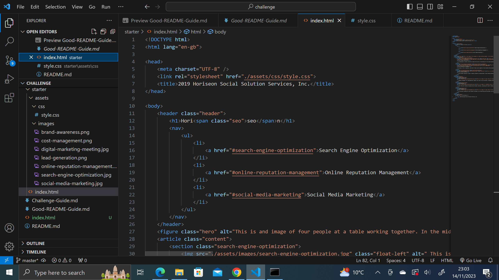

# Code-Refactor-Challenge
## Description 
An existing wesbite requires  its code refactored so that it meats accessiblity standards by the following 

+ Semantic HTML elements can be found throughout the source code
- *HTML elements follow a logical structure independent of styling and positioning
+ Image and icon elements contain accessible alt attributes
- Heading attributes fall in sequential order
+ Title elements contain a concise, descriptive title
  

## Usage 

###Visual studio code is used to edit adn alter the code to make the website more accessible.

## Credits
###ttps://docs.github.com/en/get-started/writing-on-github/getting-started-with-writing-and-formatting-on-github/basic-###writing-and-formatting-syntax 
###https://github.com/microsoft/vscode
###https://www.w3schools.com/html/html5_semantic_elements.asp 
###https://www.w3schools.com/tags/att_img_alt.asp

## License 

###Copyright (c) Microsoft Corporation. All rights reserved.

###Licensed under the MIT license.
